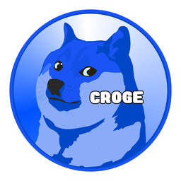

# Croge Token

Croge is a unique cryptocurrency created on the Cronos network, characterized by its playful and engaging branding. It features a logo that closely resembles Dogecoin, and sets itself apart with its vibrant blue Cronos-themed color scheme. In short, it’s the blue Cronos version of Doge. Designed to leverage the security and efficiency of the Cronos blockchain, Croge aims to foster a community-driven environment where participants can engage with a fun and lighthearted digital currency on the Cronos network.

## Token Details
- **Token Name**: Croge
- **Token Symbol**: CROGE
- **Token Contract Address**: 0xF1CB690B811c29278C2Bb8859199AaD192444488
- **Token Website**: [https://croge.io/](https://croge.io/)
- **Social Media Links**:
  - [X (Twitter)](https://x.com/CrogeCronos)
  - [Discord](https://discord.com/invite/qmdkxxkeZC)
  - [Telegram](https://t.me/+gelOW0RFOgRlMDYx)

